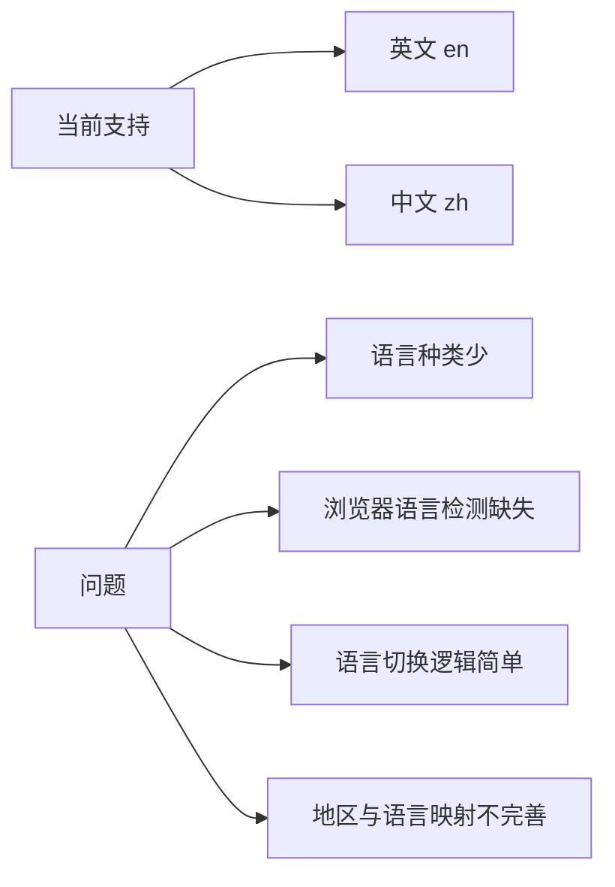
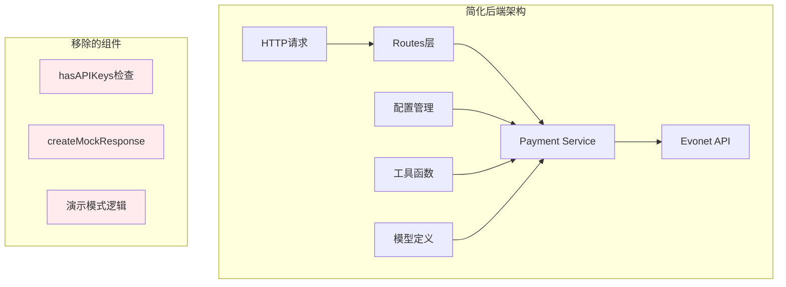
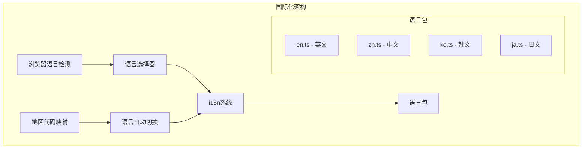
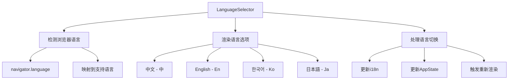
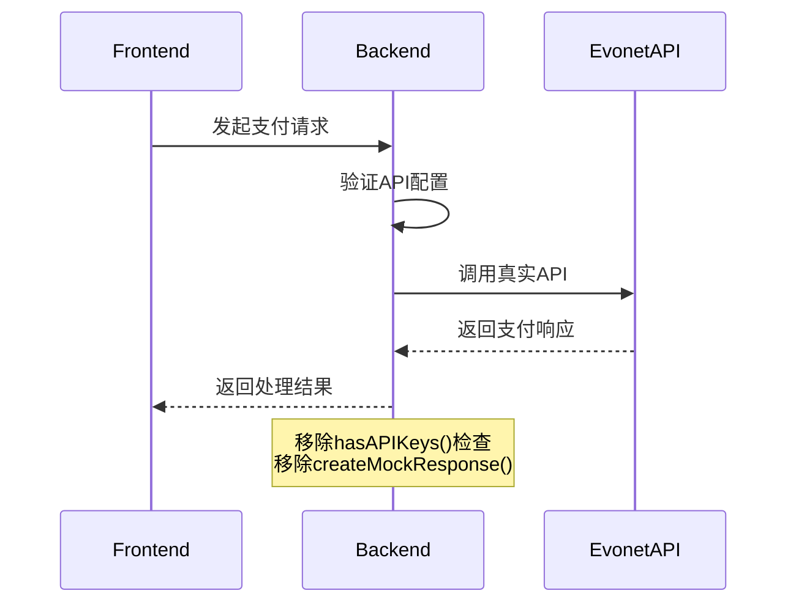
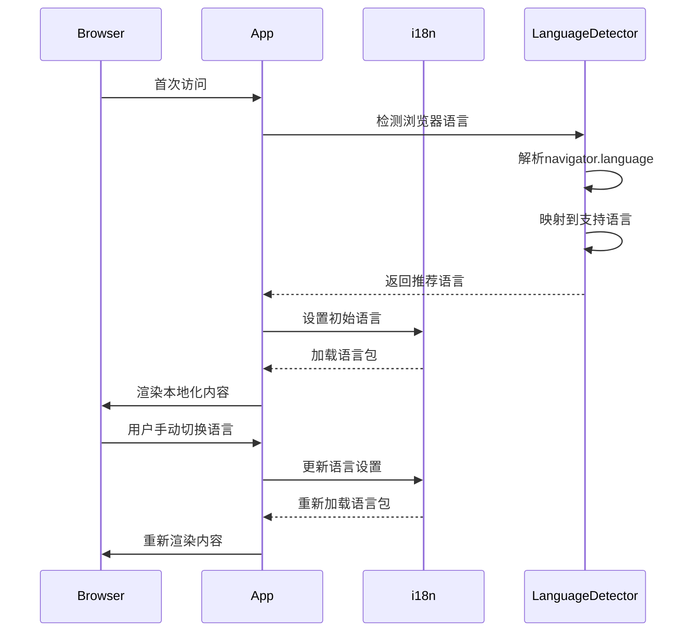

# 移除演示模式与国际化增强设计文档

## 1. 概述

本设计文档旨在针对支付演示平台进行两项重要优化：

1. **移除演示模式**：移除项目中未实际使用的演示模式功能，简化代码架构并提高代码可读性
2. **国际化增强**：完善国际化支持，主要支持中文、英文、韩文、日文四种语言，并根据浏览器语言进行智能默认选择

这些优化将显著降低项目复杂度，提升用户体验和代码质量。

## 2. 问题分析

### 2.1 演示模式问题

当前项目中存在的演示模式相关问题：

```mermaid
graph TD
    A[配置检查] --> B{hasAPIKeys()}
    B -->|无API密钥| C[演示模式]
    B -->|有API密钥| D[真实API模式]
    C --> E[createMockResponse]
    D --> F[sendEvonetRequest]
    
    G[复杂度问题] --> H[代码逻辑分支增多]
    G --> I[测试场景复杂化]
    G --> J[维护成本增加]
```

- **代码复杂度高**：`payment.go`中存在大量条件判断和模拟响应生成逻辑
- **未实际使用**：项目主要用于真实API集成演示，演示模式价值有限
- **维护成本高**：需要同时维护真实和模拟两套逻辑

### 2.2 国际化问题

当前国际化实现的不足：



- **语言支持有限**：仅支持英文和中文
- **缺乏浏览器语言检测**：无法根据用户浏览器自动选择语言
- **地区映射不完善**：韩国、日本等地区未正确映射对应语言

## 3. 架构设计

### 3.1 简化后的后端架构

移除演示模式后的后端服务架构：



### 3.2 增强的国际化架构



## 4. 数据模型设计

### 4.1 简化的配置模型

移除演示模式相关配置后的配置结构：

```go
type Config struct {
    Port        string
    Environment string
    
    // Evonet API配置（必需）
    EvonetAPIURL  string
    EvonetKeyID   string // 移除可选性，改为必需
    EvonetSignKey string // 移除可选性，改为必需
    
    // 前端配置
    FrontendURL string
}
```

### 4.2 国际化语言代码映射

```typescript
interface LanguageMapping {
  [countryCode: string]: string;
}

const LANGUAGE_MAP: LanguageMapping = {
  'GLOBAL': 'en',
  'HK': 'zh',
  'KR': 'ko',
  'JP': 'ja',
  'MY': 'en',
  'ID': 'en',
  'TH': 'en',
  'SG': 'en',
};

interface BrowserLanguageMapping {
  [browserLang: string]: string;
}

const BROWSER_LANGUAGE_MAP: BrowserLanguageMapping = {
  'zh': 'zh',
  'zh-CN': 'zh',
  'zh-TW': 'zh',
  'zh-HK': 'zh',
  'ko': 'ko',
  'ko-KR': 'ko',
  'ja': 'ja',
  'ja-JP': 'ja',
  'en': 'en',
  'en-US': 'en',
  'en-GB': 'en',
};
```

## 5. API接口设计

### 5.1 简化的支付服务接口

移除演示模式后的服务接口：

```go
type PaymentService interface {
    // 创建支付交互（LinkPay和Drop-in）
    CreateInteraction(req *models.PaymentRequest) (*models.PaymentResponse, error)
    
    // 创建直接支付（Direct API）
    CreateDirectPayment(req *models.PaymentRequest) (*models.PaymentResponse, error)
    
    // 查询支付状态
    GetPaymentStatus(merchantTransID string) (*models.Payment, error)
    
    // 查询交互状态
    GetInteractionStatus(merchantOrderID string) (*models.Payment, error)
}
```

### 5.2 前端国际化Hook接口

```typescript
interface UseInternationalizationReturn {
  language: string;
  setLanguage: (lang: string) => void;
  detectBrowserLanguage: () => string;
  getSupportedLanguage: (lang: string) => string;
  t: (key: string, options?: any) => string;
}

const useInternationalization = (): UseInternationalizationReturn;
```

## 6. 组件架构

### 6.1 语言选择组件



### 6.2 国际化Context架构

```typescript
interface InternationalizationContext {
  currentLanguage: string;
  supportedLanguages: Language[];
  changeLanguage: (language: string) => void;
  getBrowserLanguage: () => string;
}

interface Language {
  code: string;
  name: string;
  nativeName: string;
  flag?: string;
}
```

## 7. 业务流程设计

### 7.1 移除演示模式后的支付流程



### 7.2 增强的国际化流程



## 8. 错误处理机制

### 8.1 API配置验证

移除演示模式后，需要严格的API配置验证：

```go
func (s *PaymentService) validateConfig() error {
    if s.config.EvonetKeyID == "" {
        return errors.New("EVONET_KEY_ID is required")
    }
    if s.config.EvonetSignKey == "" {
        return errors.New("EVONET_SIGN_KEY is required") 
    }
    if s.config.EvonetAPIURL == "" {
        return errors.New("EVONET_API_URL is required")
    }
    return nil
}
```

### 8.2 国际化降级机制

```typescript
const getTranslation = (key: string, language: string): string => {
  try {
    // 尝试获取当前语言翻译
    return i18n.t(key, { lng: language });
  } catch (error) {
    // 降级到英文
    try {
      return i18n.t(key, { lng: 'en' });
    } catch (fallbackError) {
      // 最终降级到键名
      return key;
    }
  }
};
```

## 9. 性能优化

### 9.1 语言包懒加载

```typescript
const loadLanguagePack = async (language: string) => {
  try {
    const langModule = await import(`./locales/${language}.ts`);
    return langModule.default;
  } catch (error) {
    console.warn(`Failed to load language pack: ${language}`);
    // 降级到英文
    const enModule = await import('./locales/en.ts');
    return enModule.default;
  }
};
```

### 9.2 缓存机制

```typescript
interface LanguageCache {
  [language: string]: any;
}

class InternationalizationManager {
  private cache: LanguageCache = {};
  
  async getLanguagePack(language: string) {
    if (this.cache[language]) {
      return this.cache[language];
    }
    
    const pack = await loadLanguagePack(language);
    this.cache[language] = pack;
    return pack;
  }
}
```

## 10. 安全考虑

### 10.1 API密钥管理

移除演示模式后，API密钥成为必需配置：

- **环境变量存储**：严格使用环境变量存储敏感信息
- **配置验证**：启动时验证必需配置项
- **错误处理**：配置缺失时提供明确的错误信息

### 10.2 国际化安全

- **输入验证**：验证语言代码格式
- **XSS防护**：确保翻译内容不包含恶意脚本
- **CSP策略**：配置内容安全策略支持国际化资源

## 11. 测试策略

### 11.1 单元测试

```go
// 测试API配置验证
func TestPaymentService_ValidateConfig(t *testing.T) {
    tests := []struct {
        name    string
        config  *config.Config
        wantErr bool
    }{
        {
            name: "valid config",
            config: &config.Config{
                EvonetKeyID:   "test_key",
                EvonetSignKey: "test_sign",
                EvonetAPIURL:  "https://api.test.com",
            },
            wantErr: false,
        },
        {
            name: "missing key ID",
            config: &config.Config{
                EvonetSignKey: "test_sign",
                EvonetAPIURL:  "https://api.test.com",
            },
            wantErr: true,
        },
    }
}
```

### 11.2 国际化测试

```typescript
describe('Internationalization', () => {
  test('should detect browser language correctly', () => {
    Object.defineProperty(navigator, 'language', {
      value: 'zh-CN',
      configurable: true,
    });
    
    const result = detectBrowserLanguage();
    expect(result).toBe('zh');
  });
  
  test('should fallback to English for unsupported languages', () => {
    const result = getSupportedLanguage('fr');
    expect(result).toBe('en');
  });
});
```

## 12. 部署与配置

### 12.1 环境变量配置

```bash
# 必需配置（移除演示模式后）
EVONET_KEY_ID=kid_eb9cf3216111441c8d1b11584bf2a9c8
EVONET_SIGN_KEY=sk_sandbox_3a0012c70873421b971a9581f81e6000
EVONET_API_URL=https://sandbox.evonetonline.com

# 可选配置
PORT=8080
ENVIRONMENT=production
FRONTEND_URL=https://your-domain.com
```

### 12.2 前端构建配置

```typescript
// vite.config.ts
export default defineConfig({
  // 支持国际化资源的构建优化
  build: {
    rollupOptions: {
      output: {
        manualChunks: {
          'i18n': ['i18next', 'react-i18next'],
          'locales': [
            './src/locales/en.ts',
            './src/locales/zh.ts',
            './src/locales/ko.ts',
            './src/locales/ja.ts',
          ],
        },
      },
    },
  },
});
```

## 13. 迁移指南

### 13.1 移除演示模式的步骤

1. **配置验证增强**：在应用启动时验证必需的API配置
2. **移除条件逻辑**：删除`hasAPIKeys()`检查和相关分支
3. **移除模拟方法**：删除所有`createMock*`方法
4. **简化错误处理**：移除演示模式相关的错误处理逻辑
5. **更新文档**：更新API文档，明确配置要求

### 13.2 国际化增强的步骤

1. **添加语言包**：创建韩文和日文语言文件
2. **实现语言检测**：添加浏览器语言检测逻辑
3. **更新语言映射**：完善地区与语言的映射关系
4. **增强组件**：更新国际化相关组件
5. **测试验证**：全面测试多语言功能

## 14. 风险评估

### 14.1 移除演示模式风险

| 风险项 | 影响程度 | 缓解措施 |
|--------|----------|----------|
| 配置错误导致启动失败 | 高 | 增强配置验证和错误提示 |
| 开发环境配置复杂化 | 中 | 提供详细的环境配置文档 |
| 测试环境依赖真实API | 中 | 使用测试环境API密钥 |

### 14.2 国际化增强风险

| 风险项 | 影响程度 | 缓解措施 |
|--------|----------|----------|
| 翻译质量问题 | 中 | 专业翻译审核 |
| 浏览器兼容性 | 低 | 兼容性测试和降级处理 |
| 性能影响 | 低 | 语言包懒加载和缓存 |